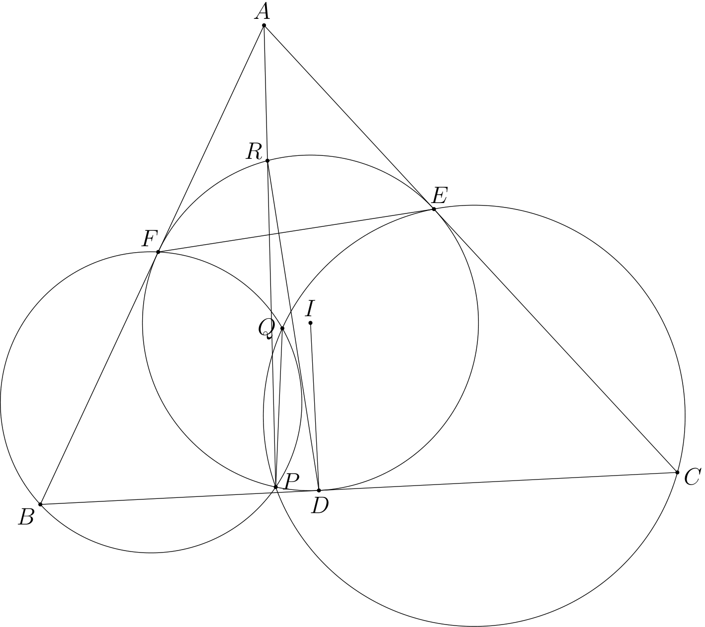

# Geometric Figure Description

This project is a [gfd](gfd.md) to [asymptote](https://asymptote.sourceforge.io/) converter. You can use it to quickly draw the figures of olympiad geometry problems. It also generates a txt file with the same name that contains information about the properties that the objects in the figure satisfy such as collinearity. This repository will eventualy be combined with [geometry-generator](https://github.com/Hakkush-07/geometry-generator) which is a project for generating olympiad level geometry problems.

You can use the output asy as
 - a standalone figure by following the necessary steps below for producing pdf files from asy.
 - an embed in latex documents by using `asymptote` package and `\begin{asy} ... \end{asy}` environment.

You can see the examples that have a few IMO problems. IMO2019 P6 is below

```
A B C = triangle
I = A B C incenter
omega = A B C incircle

D = B C line* omega tangent_point
E = C A line* omega tangent_point
F = A B line* omega tangent_point

R = D D E F line* perpendicular_line* omega second_intersection_plc
P = R A R line* omega second_intersection_plc
Q = P P C E circumcircle* P B F circumcircle* second_intersection_pcc

x y z = D I line P Q line A I perpendicular_through
```



## Run

To run this, use the following command by providing the correct path for gfd file. It will generate an asy and a txt file with the same name if gfd file contains no errors.

```sh
python main.py main.gfd
```

## Asymptote

To produce the figure pdf, use the following command. For more information about asymptote command line options, see [here](https://asymptote.sourceforge.io/doc/Options.html). Alternatively, you can use this [online tool](http://asymptote.ualberta.ca/).

```sh
asy main.asy -o main.pdf -f pdf -noV
```


